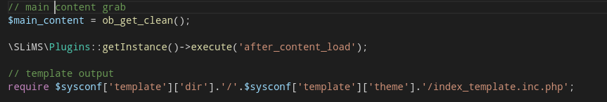

# visitorwebcounter
## Perhatian
Plugin ini hanya untuk SLiMS versi >= 9.4.0

## Cara Pasang
copy paste script dibawah ini (Jika belum ada)

```php
\SLiMS\Plugins::getInstance()->execute('after_content_load');
```

pada file index.php dibawah script

```php
// main content grab
$main_content = ob_get_clean();
```

Contoh :


